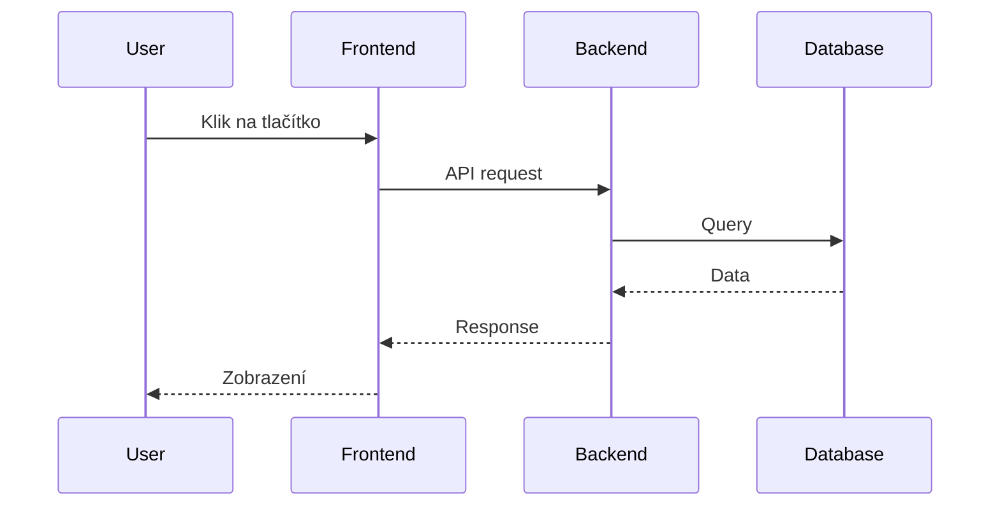

# Diagram Generation

Tři způsoby tvorby diagramů — každý se hodí na něco jiného. Lukášův decision tree z lekce 5.

## Decision tree

```
Jaký diagram?
├── Architektura, flow, sequence, gantt, ER, class
│   └── MERMAID (default volba — text-based, agent ho čte snadno)
├── Custom vizualizace (mapy, trading, scatter, treemaps)
│   └── D3.JS (JavaScript knihovna — flexibilita)
└── Cloud architektura s ikonami (AWS, Azure, GCP, K8s)
    └── DRAW.IO (XML formát + ikony)
```

## 1. Mermaid — default volba

**Proč:** Text-based formát, agent ho čte stejně snadno jako kód. uživatelka ho vidí jako pěkný obrázek v Markdown preview.

**Použití:**


**Podporované typy:**
- Flowchart, Sequence, Class, State
- ER diagram, Gantt, Pie chart, Mind map
- Git graph, User journey, Quadrant chart

**Tip pro architekturu:** Vždycky preferuj Mermaid pro dokumentaci v `docs/architecture.md` — agent může číst i upravovat.

## 2. D3.js — když Mermaid nestačí

**Proč:** JavaScript knihovna, můžeš generovat libovolný typ vizualizace. Treba mapy, trading grafy, custom scatter ploty.

**Output:** HTML soubor + JS, otevřeš v browseru.

**Use cases:**
- Geografické mapy (D3-geo)
- Trading svíčkové grafy
- Custom scatter / bubble plots
- Force-directed grafy (network)
- Sankey diagramy

## 3. Draw.io — cloud architektura

**Proč:** XML formát + obrovská knihovna ikon (AWS, Azure, GCP, Kubernetes, Cisco, Microsoft, atd.)

**Use cases:**
- Cloud infrastructure diagram (AWS s VPC, EC2, RDS, S3 ikonami)
- Kubernetes architektura (pods, services, ingress)
- Network topology
- Org charts

**Soubor:** `.drawio` (XML)

**Tip od Lukáše:** Po generování je často potřeba post-processing (čáry přes sebe, špatné pozice). V media pluginu má hook, který to automaticky čistí.

## Setup

Pokud máš Lukášův marketplace (skill `lukas-marketplace`) nainstalovaný a media plugin enabled, všechny 3 typy fungují out-of-the-box.

Bez něj:
```bash
# Mermaid — žádná instalace, podporuje GitHub/VS Code preview
# D3 — npm install d3
# Draw.io — desktopová app nebo VS Code extension
```

## Workflow (od Lukáše)

```
1. "Vytvoř diagram architektury naší aplikace"
2. Cloud Code se rozhodne → Mermaid (default)
3. Pokud Lukáš/uživatelka řekne "použij Draw.io s AWS ikonami"
   → Cloud Code použije Draw.io místo Mermaid
4. uživatelka ho otevře, případně manuálně doupraví, vrátí
```

## Tipy

- **Pro PDF dokumenty s obrázky** — místo embedovat obrázky preferuj Mermaid diagramy. Agent je pak může i upravovat.
- **Pro prezentace** — Mermaid v Reveal.js nebo statický export do PNG
- **Pro architektonickou dokumentaci** — Draw.io pro velký přehled, Mermaid pro detaily
- **Když je obrázek z dokumentace** — řekni Cloud Code "převeď ten obrázek do Mermaid diagramu" — pak je v textové formě, lépe se udržuje

## Vztah k ostatním skillům
- `lukas-marketplace` — odkud tato funkcionalita pochází
- `Art` — pro generování statických obrázků (kde Mermaid nestačí)
- `office-creative-workflow` — kdy použít jaký diagram v dokumentech
